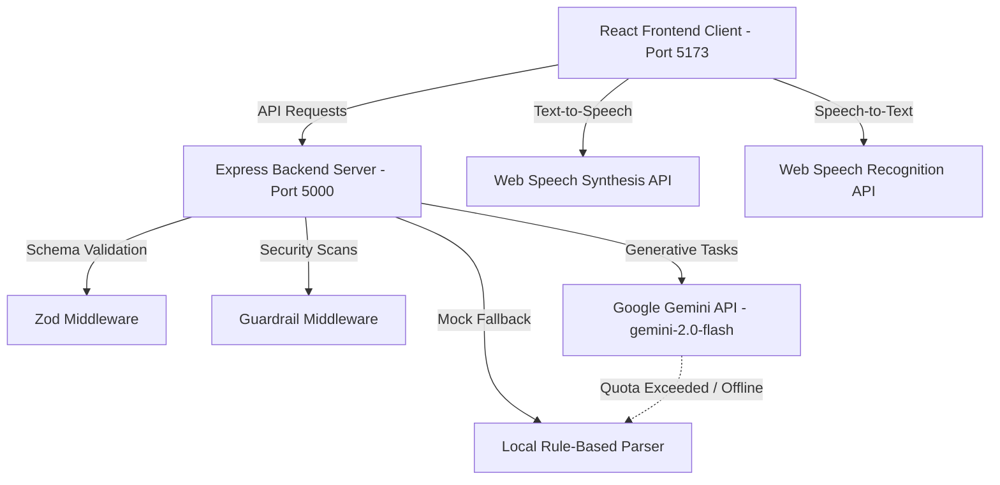
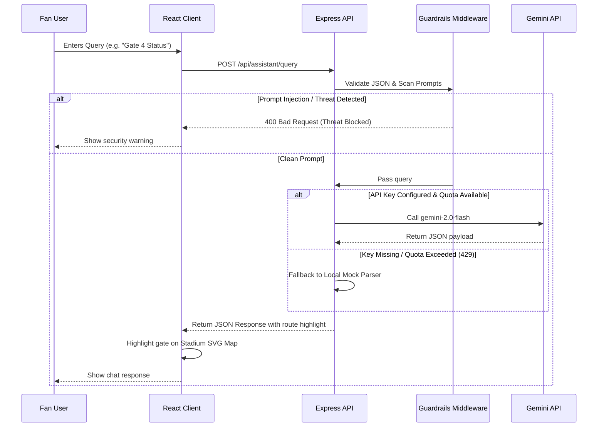
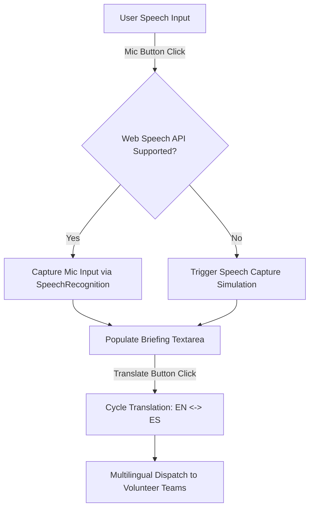

# FanPulse 2026: FIFA World Cup Stadium Hub

**FanPulse 2026** is a comprehensive, full-stack, AI-enabled web application built to enhance stadium operations and spectator concierge services for the 2026 FIFA World Cup.

---

## 🏆 Core Features

1. **Smart Multilingual Fan Assistant & Real-Time Navigation**:
   - **GenAI Concierge Chat**: Dynamic chatbot answering spectator queries regarding match schedules, gate wait times, security rules, food counters, and accessible facilities. Supports toggling between **English, Spanish, and French**.
   - **Interactive SVG Stadium Layout Map**: High-fidelity map with color-coded gate loads (critical load causes G4 to flash red), wheelchair accessibility trails, and highlighted routes based on chat directions. Keyboard navigable (Tab/Enter).
   - **AR Wayfinding Navigation**: Simulated real-time smartphone camera overlay providing directional guidance, target reticles, and seat distance telemetry directly to gates and seating sectors.

2. **Venue Staff & Operational Intelligence Dashboard**:
   - **Telemetry Control Center**: Live metrics displaying active fan attendance vs stadium capacity, solar panel power output, smart waste bin average fill rates, and Recharts charts of gate queues.
   - **Operational Volunteer Action Simulator**: Generates volunteer checklists and dispatches instructions (assigning priority levels and role tags: Security, Medical, Volunteer Core) from natural language incidents input by organizers.

3. **Volunteer Hub Command Portal**:
   - **AI Briefing Center**: Multilingual dispatcher supporting voice-input capture (via browser Web Speech API with automatic simulation fallbacks) and live text translation to Spanish and French.
   - **Top Volunteer Teams Leaderboard**: Dynamic gamified tracker with points awards, details, and interactive score controls.

4. **Inclusive Accessibility Portal**:
   - **Speech Synthesis Narration (TTS)**: Narrates live match events out loud, with a Web Speech settings control drawer to adjust volume, speed, and pitch.
   - **ASL Sign Language Assistant**: Virtual interpreter stream that translates typed announcements into sign language descriptions.
   - **Sensory & Quiet Zone Management**: Sensory decibel alert feed and interactive Sensory Wayfinding map showing quiet zones and step-free elevators.

---

## 📊 System Architecture & Workflows

### 1. System Topology
The application follows a decoupled Monorepo architecture where the React frontend client communicates with a secure Express backend API, integrating native browser APIs and the Google Gemini API.



---

### 2. AI Chatbot Sequence Workflow
This sequence diagram shows the step-by-step query validation, prompt safety scanning, and Gemini integration/mock fallback routing.



---

### 3. Voice Input & ASL Translation Flow
How voice captures and multilingual updates propagate to staff and volunteers.



---

## 🛡️ Security & Input Guardrails

- **Strict Input Validation**: All incoming requests are parsed against strict **Zod schemas** in the backend middleware layer to neutralize buffer overflows or malformed fields.
- **Safety Guardrails**: Scans requests for prompt injection indicators (`"ignore previous instructions"`, `"override system"`, etc.) and SQLi/XSS keywords, blocking threats with a `400 Bad Request` and error code `PROMPT_INJECTION_BLOCKED`.
- **Global Error Handling**: Production environment sanitizes and hides database stack traces or low-level API error messages to prevent data leaks.
- **Zero Secrets Hardcoded**: Leverages a backend `.env` configuration file to check for `GEMINI_API_KEY`. If the key is missing or quota is exhausted, a highly detailed rules-based mock parser mimics the exact behavior of Gemini in all supported languages.

---

## ♿ Accessibility (WCAG 2.1 AA Compliance)

- **Semantic HTML**: Built using landmark elements (`<header>`, `<main>`, `<section>`).
- **Interactive SVG Map Keyboard Accessibility**: Clickable gates and sectors have `tabIndex={0}`, standard `role="button"`, descriptive `aria-label` tags, and respond to Space and Enter key presses.
- **Accessible Color Contrast**: Complies with AA contrast ratios.
- **Screen Reader Friendly**: Uses `aria-live="polite"` tags to narrate updates.

---

## 💻 Tech Stack

- **Backend**: Node.js, Express, TypeScript, Zod, Helmet, CORS, Google GenAI SDK (`@google/generative-ai`), Vitest.
- **Frontend**: React (Vite), TypeScript, Tailwind CSS, Recharts, Lucide Icons.

---

## 🚀 Execution & Setup Guide

### 1. Installation

From the root directory, install all dependencies for both the backend and frontend at once:

```bash
npm run install:all
```

*(Alternatively, run `npm install` in the root, `/backend`, and `/frontend` directories).*

### 2. Configure Environment Variables

Create a `.env` file in the `backend/` directory:

```env
PORT=5000
GEMINI_API_KEY=your_gemini_api_key_here
NODE_ENV=development
```

*Note: If `GEMINI_API_KEY` is not provided or quota is exceeded, the application automatically triggers the rule-based local mock GenAI model to allow full testing immediately.*

### 3. Run Dev Server

Start both the backend and frontend concurrently with a single command from the root folder:

```bash
npm run dev
```

- **Frontend client** runs on: `http://localhost:5173`
- **Backend API** runs on: `http://localhost:5000`

### 4. Running Verification Tests

Execute the validation, sanitization, and mock endpoint test suite in the backend:

```bash
npm run test
```
