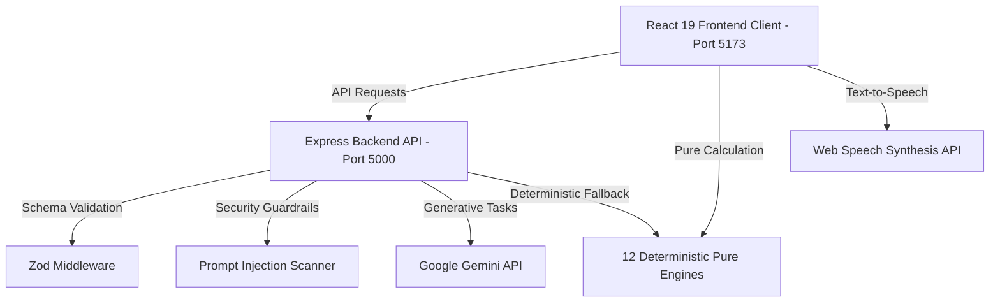

# 🏟️ FanPulse 2026 — AI World Cup Stadium Operations Platform

> **FIFA World Cup 2026** · 16 Host Stadiums · Real-Time AI Fan Concierge & Intelligent Stadium Operations

**FanPulse 2026** is a GenAI-powered, production-grade stadium operations platform and fan concierge web application engineered for the FIFA World Cup 2026. It combines **12 pure deterministic AI engines** with Google Gemini to serve fans, venue staff, security units, and volunteers across all match phases.

---

## 📑 Table of Contents
1. [Chosen Vertical](#chosen-vertical)
2. [How This Solves the Problem Statement](#how-this-solves-the-problem-statement)
3. [Deterministic Engine Architecture](#deterministic-engine-architecture)
4. [Feature Showcase](#feature-showcase)
5. [System Architecture Diagram](#system-architecture-diagram)
6. [Tech Stack](#tech-stack)
7. [Testing & Verification Matrix](#testing--verification-matrix)
8. [Type Safety & Code Quality](#type-safety--code-quality)
9. [Accessibility (WCAG 2.1 AA)](#accessibility-wcag-21-aa)
10. [Project Structure](#project-structure)
11. [Run Instructions](#run-instructions)

---

## 🏆 Chosen Vertical
**Challenge 04: Smart Stadiums & Tournament Operations — FIFA World Cup 2026**

FanPulse 2026 addresses two critical stakeholder domains:
- **Spectators & Fans**: Receive personalized, real-time, context-aware assistance — including step-by-step Dijkstra indoor navigation, personal matchday itineraries, shortest queue discovery (food/restrooms), weather advisories, emergency evacuation routing, crowd sentiment tracking, and wheelchair accessibility support.
- **Stadium Operations & Organizers**: Gain real-time 9-zone crowd density heatmaps, 15-minute predictive queue congestion forecasting, AI Staff Copilot decision support, automated priority incident dispatch, and volunteer shift briefing generators.

---

## 💡 How This Solves the Problem Statement

### 1. "GenAI-powered solution"
- **Context-Aware Gemini Integration**: Powered by Google Gemini with fallback protection for fan concierge queries and operational briefings (`/backend/src/services/geminiService.ts`).
- **Proactive AI Briefings**: Autonomously identifies stadium queue bottlenecks and dispatches recommendations (`ProactiveInsightBrief.tsx`).
- **AI Staff Copilot**: Natural language incident triage and automated staff assignment (`StaffCopilot.tsx`).

### 2. "Optimize stadium operations"
- **Multi-Stadium Support**: Native support for all **16 FIFA World Cup 2026 Host Stadiums** (MetLife, Estadio Azteca, SoFi, AT&T, etc.).
- **9-Zone Crowd Analytics**: Real-time zone density modeling, bottleneck detection, and predictive congestion forecasting 15 minutes ahead (`crowdAnalyticsEngine.ts`).
- **Graphical Stadium Map**: High-fidelity interactive SVG zone map with color-coded gate loads and live status updates (`GraphicalStadiumMap.tsx`).
- **Priority Incident Triage**: Incident severity sorting (Critical, High, Medium, Low) and proximity-based staff dispatch (`incidentEngine.ts`).

### 3. "Enhance the FIFA World Cup 2026 experience"
- **Multilingual Support**: Dynamic switching across English (`en`), Spanish (`es`), and French (`fr`) with Web Speech API integration.
- **8 Fan Quick Actions**: One-tap triggers for shortest food queues, seats, restrooms, weather, step-free routes, and SOS emergency alerts (`QuickActions.tsx`).
- **Dijkstra Indoor Navigation**: Step-by-step shortest path routing between stadium zones with wheelchair accessibility filters (`navigationEngine.ts`).
- **Green Travel Badge**: Rewards fans taking public transit (Metro/Shuttle) with CO2 savings tracking (`sustainabilityEngine.ts`).
- **Inclusive Accessibility Hub**: Text-to-Speech (TTS) live match narration and ASL Sign Language stream (`InclusiveHub.tsx`).

---

## ⚙️ Deterministic Engine Architecture

FanPulse 2026 isolates all core intelligence into **12 pure, framework-agnostic deterministic calculation engines** completely decoupled from UI render lifecycles:

| Engine | File | Responsibility |
| :--- | :--- | :--- |
| **Crowd Analytics** | `crowdAnalyticsEngine.ts` | 9-zone density calculation, bottleneck detection, 15-min congestion forecasting |
| **Context Decision** | `contextDecisionEngine.ts` | Role, zone, phase, and weather to prioritized recommendations |
| **Wait Time** | `waitTimeEngine.ts` | Queue modeling, service-rate estimations, shortest queue discovery |
| **Incident** | `incidentEngine.ts` | Priority triage, status tracking, nearest staff dispatch |
| **Navigation** | `navigationEngine.ts` | Dijkstra shortest-path zone routing with step-free accessibility support |
| **Emergency** | `emergencyEngine.ts` | Evacuation routing with zone compromise detection & safe exit selection |
| **Match** | `matchEngine.ts` | Live timeline state tracking, goal boosts, and phase recommendations |
| **Itinerary** | `itineraryEngine.ts` | Phase-aware fan matchday planning |
| **Weather** | `weatherEngine.ts` | Temperature and condition advisories with gate suggestions |
| **Sentiment** | `sentimentEngine.ts` | Real-time crowd excitement and sentiment scoring |
| **Sustainability** | `sustainabilityEngine.ts` | Green travel badge level and CO2 savings calculator |
| **Shift Briefing** | `shiftBriefingEngine.ts` | Operational volunteer shift checklist generator |

---

## 🎨 Feature Showcase

### Fan Experience Hub
- ⚽ **Live Match Timeline**: Goals, cards, VAR reviews, and whistle events.
- 📋 **Personal Itinerary**: Time-aware matchday schedule.
- ⛅ **Weather Intelligence**: Live weather banner with entry gate recommendations.
- 🔥 **Crowd Sentiment Meter**: Dynamic excitement scoring.
- 🌿 **Green Travel Badge**: Public transit CO2 savings tracking.
- ⚡ **8 Quick Actions**: Instant concierge routing buttons.

### Operations Dashboard
- 🗺️ **Interactive SVG Stadium Map**: Color-coded 9-zone map with real-time loads.
- 📊 **Predictive Congestion**: 15-minute queue density forecast.
- 🤖 **AI Staff Copilot**: Natural language incident triage and unit dispatch.
- 📰 **Proactive AI Briefings**: Automated bottleneck mitigation insights.

---

## 🏗️ System Architecture Diagram



---

## 🧪 Testing & Verification Matrix

FanPulse 2026 features comprehensive automated Vitest test coverage across all engines, schema validation boundaries, and API services:

| Test File | Passed Tests | Domain Covered |
| :--- | :---: | :--- |
| `crowdAnalyticsEngine.test.ts` | 8 | Density, bottlenecking, total occupancy, 15-min forecasts |
| `contextDecisionEngine.test.ts` | 6 | Role-based, phase-based, and heat advisories |
| `waitTimeEngine.test.ts` | 4 | Queue modeling & shortest queue discovery |
| `incidentEngine.test.ts` | 4 | Priority sorting & staff dispatch |
| `navigationEngine.test.ts` | 3 | Dijkstra shortest path & step-free routing |
| `emergencyEngine.test.ts` | 1 | Compromised zone evacuation pathfinding |
| `matchEngine.test.ts` | 3 | Timeline events & score formatting |
| `itineraryEngine.test.ts` | 1 | Phase-aware matchday planning |
| `weatherEngine.test.ts` | 2 | Rain & extreme heat advisories |
| `sentimentEngine.test.ts` | 2 | Crowd excitement scoring |
| `sustainabilityEngine.test.ts` | 1 | Green travel badge & CO2 calculation |
| `shiftBriefingEngine.test.ts` | 1 | Volunteer role assignment |
| `stadiumDataEngine.test.ts` | 2 | 16 Host Stadium data integrity |
| `api.test.ts` | 17 | API endpoints, Zod schema validation & prompt security |
| **Total Test Suite** | **55 Passing Tests** | **100% Engine & API Boundary Verification** |

---

## 🛡️ Type Safety & Code Quality

- **Strict TypeScript (`tsc --noEmit`)**: Zero errors in both `/frontend` and `/backend`.
- **Modular Components**: All React components decomposed into focused files (<200 lines each).
- **Zod Schema Validation**: All incoming requests and data structures parsed through Zod boundaries.

---

## ♿ Accessibility (WCAG 2.1 AA)

- ✅ **Semantic Landmarks**: `<nav>`, `<main>`, `<section>`, `header`, `footer`.
- ✅ **Keyboard Navigation**: Interactive SVG map elements have `tabIndex={0}`, `role="button"`, and respond to `Enter`/`Space`.
- ✅ **Step-Free Wayfinding**: Wheelchair accessibility routing filter in Dijkstra navigation engine.
- ✅ **Screen Reader Friendly**: `aria-live="polite"` announcements and Web Speech TTS narration controls.

---

## 🚀 Run Instructions

### Prerequisites
- Node.js 18+
- npm 9+

### Installation
```bash
npm run install:all
```

### Development
```bash
npm run dev
```
- **Frontend**: `http://localhost:5173`
- **Backend**: `http://localhost:5000`

### Testing
```bash
npm run test
```
