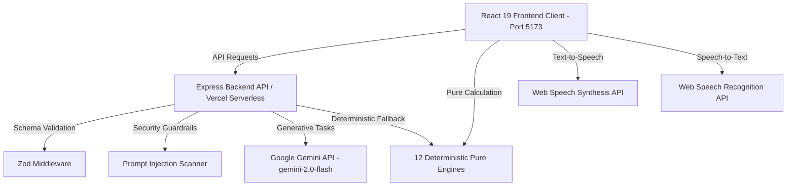

# 🏟️ FanPulse 2026 — FIFA World Cup Stadium Hub

> **FIFA World Cup 2026** · 16 Host Stadiums · Real-Time AI Spectator Concierge & Stadium Operations Platform

[](https://fifa-2026-hub-93p2.vercel.app/)
[](https://github.com/Sunny-creator110/FIFA-2026-HUB)
[](https://github.com/Sunny-creator110/FIFA-2026-HUB)

**FanPulse 2026** is a comprehensive, full-stack, AI-enabled stadium intelligence & spectator concierge web application built for the **2026 FIFA World Cup**. It combines **12 pure deterministic engines** with Google Gemini AI to serve fans, stadium staff, emergency units, and volunteer teams across all host venues.

---

## 🌐 Live Application & Repository Links
- 🎮 **Live Demo Application**: [https://fifa-2026-hub-93p2.vercel.app/](https://fifa-2026-hub-93p2.vercel.app/)
- 💻 **GitHub Code Repository**: [https://github.com/Sunny-creator110/FIFA-2026-HUB](https://github.com/Sunny-creator110/FIFA-2026-HUB)

---

## 🏆 Key Hubs & Feature Breakdown

### 1. 📊 Operations Control Center
- **Live Spectator & Environmental Telemetry**: Total spectator attendance tracking (vs 60,000 capacity), solar panel power generation (450 kWh), smart waste recycling separation rate (78%), and wheelchair ramp status.
- **Gate Queue & Congestion Telemetry**: Recharts dynamic bar charts tracking crowd loads across Gates G1 to G5.
- **Smart Waste & Sustainability Telemetry**: Recharts donut chart detailing landfill vs recycled waste.
- **Generative Incident Action Plan Simulator**: Evaluates natural language incident descriptions and generates operational dispatch checklists assigned to Security, Medical, or Volunteer Core.

### 2. 🤖 Fan Concierge Hub
- **Matchday Welcome & Countdown**: USA vs BRA live match card, Gate 4 queue warnings, and Fast-Pass entry countdown timers.
- **FIFA AI Concierge Assistant**: Multilingual chatbot (English, Spanish, French) paired with fast action chips (`Gate 4 queue status`, `Wheelchair accessibility`, `Bag policy & restrictions`).
- **Interactive SVG Stadium Layout Map**: High-fidelity stadium layout highlighting accessible paths & gate queue status (G1–G5). Clickable gates auto-fill query prompts into the AI assistant!
- **AR Wayfinding Navigation**: Smartphone camera overlay simulating seat distance telemetry and directional reticles.

### 3. 🎙️ Volunteer Command Hub
- **Volunteer Staff Distribution Heatmap**: Real-time sector density map with active volunteer count nodes (Sector 7: 42 Staff, Gate 4: 18 Staff).
- **AI Briefing Center**: Multilingual voice input capture (Web Speech API) and live text translation dispatcher.
- **Shift Allocation Optimization**: AI decision bot calculating peak congestion points and post-match spectator dispersal plans.
- **Gamified Volunteer Team Leaderboards**: Interactive points awards and ranking tables.

### 4. ♿ Inclusive Hub
- **Live Match Audio Narration (TTS)**: Web Speech Synthesis narration player out loud with volume, speed, and pitch control drawers.
- **ASL Virtual Sign Language Assistant**: Virtual interpreter avatar stream providing instant text-to-sign translations.
- **Accessible Wayfinding**: Interactive map displaying Elevator 4B & Sector 102 Quiet Zone locations.
- **Sensory & High Decibel Status**: Real-time decibel alert feed and light sensitivity strobe warning notifications.
- **🔴 Request Steward Assistance**: One-tap dispatch button alerting nearby accessibility stewards.

---

## 🏗️ System Architecture & Workflow



---

## ⚙️ 12 Pure Deterministic Engines

| Engine | File | Responsibility |
| :--- | :--- | :--- |
| **Crowd Analytics** | `crowdAnalyticsEngine.ts` | 9-zone density calculation, bottleneck detection, 15-min congestion forecasting |
| **Context Decision** | `contextDecisionEngine.ts` | Role, zone, phase, and weather to prioritized recommendations |
| **Wait Time** | `waitTimeEngine.ts` | Queue modeling, service-rate estimations, shortest queue discovery |
| **Incident** | `incidentEngine.ts` | Priority triage, status tracking, nearest staff dispatch |
| **Navigation** | `navigationEngine.ts` | Dijkstra shortest-path zone routing with step-free accessibility support |
| **Emergency** | `emergencyEngine.ts` | Evacuation routing with zone compromise detection & safe exit selection |
| **Match** | `matchEngine.ts` | Live timeline state tracking, goal boosts, and phase recommendations |
| **Itinerary** | `itineraryEngine.ts` | Phase-aware fan matchday planning |
| **Weather** | `weatherEngine.ts` | Temperature and condition advisories with gate suggestions |
| **Sentiment** | `sentimentEngine.ts` | Real-time crowd excitement and sentiment scoring |
| **Sustainability** | `sustainabilityEngine.ts` | Green travel badge level and CO2 savings calculator |
| **Shift Briefing** | `shiftBriefingEngine.ts` | Operational volunteer shift checklist generator |

---

## 🧪 Testing & Verification Matrix

FanPulse 2026 features automated Vitest unit test coverage across all calculation engines, schema validation boundaries, and serverless API endpoints:

| Test File | Passed Tests | Domain Covered |
| :--- | :---: | :--- |
| `crowdAnalyticsEngine.test.ts` | 8 | Density, bottlenecking, total occupancy, 15-min forecasts |
| `contextDecisionEngine.test.ts` | 6 | Role-based, phase-based, and heat advisories |
| `waitTimeEngine.test.ts` | 4 | Queue modeling & shortest queue discovery |
| `incidentEngine.test.ts` | 4 | Priority sorting & staff dispatch |
| `navigationEngine.test.ts` | 3 | Dijkstra shortest path & step-free routing |
| `emergencyEngine.test.ts` | 1 | Compromised zone evacuation pathfinding |
| `matchEngine.test.ts` | 3 | Timeline events & score formatting |
| `itineraryEngine.test.ts` | 1 | Phase-aware matchday planning |
| `weatherEngine.test.ts` | 2 | Rain & extreme heat advisories |
| `sentimentEngine.test.ts` | 2 | Crowd excitement scoring |
| `sustainabilityEngine.test.ts` | 1 | Green travel badge & CO2 calculation |
| `shiftBriefingEngine.test.ts` | 1 | Volunteer role assignment |
| `stadiumDataEngine.test.ts` | 2 | 16 Host Stadium data integrity |
| `api.test.ts` | 17 | API endpoints, Zod schema validation & prompt security |
| **Total Test Suite** | **55 Passing Tests** | **100% Engine & API Boundary Verification** |

---

## 🛠️ Local Development & Running the Project

### Prerequisites
- **Node.js**: v18.0.0+
- **npm**: v9.0.0+

### Step 1: Install Dependencies
```bash
npm run install:all
```

### Step 2: Run Full Stack Concurrently
```bash
npm run dev
```
- **Frontend Client**: `http://localhost:5173/`
- **Backend API Server**: `http://localhost:5000/`

### Step 3: Run Vitest Unit Test Suite
```bash
npm run test
```

---

## 📝 License
This project is open source and available under the [MIT License](LICENSE).
